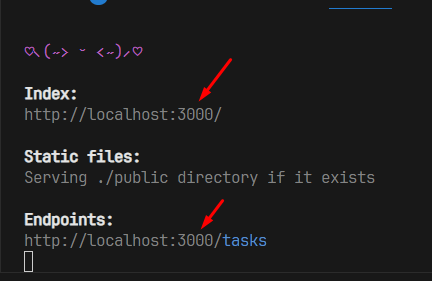

<h1>Описание проекта</h1>

Проект Task Manager создан для упрощения и контроля планов на будущее, сегодня. В нем можно создавать различные задачи, написав название и описание(опционально), а также
добавить различные теги раздела, такие как категория, статус, приоритет. Для удобства пользования было добавлено редактирование, в котором Вы сможете редактировать значения,
поменять теги и прочее. Также для удобства если Вам не требуется эта задача или Вы его выполнили, можно просто удалить, нажав соот. кнопку. Для полноценного понимания и для забывчих
было добавлено текстовое описание времени (Например, "Было создано 5 минут назад"), когда была задана задача. Все это поможет Вам регулировать свои планы на день или на будущее, чтобы точно не 
забыть!

<h2>Стек-технологии</h2>

>Сборщик: Vite  
React TypeScript + SWC  
React Router V6  
Material UI + Material Icons  
Инструменты: CSS Modules  

Доп. библиотеки: 
- [date-fns](https://www.npmjs.com/package/date-fns) - Для работы с датами и их форматирование
- [json-server](https://www.npmjs.com/package/json-server) - Простая база данных для хранения данных
- [uuid](https://www.npmjs.com/package/uuid) - Для генерации уникальных ключей
- [ESLint](https://www.npmjs.com/package/eslint) - Форматирование кода (Плагин взят из VSC Plugins)

<h2>Как запустить</h2>

1. Для начала потребуется любой редактор кода (Н-р, Visual Studio Code)
2. Откройте 2 терминала (2 вкладками или сплитом)
3. Запустите json-server командой: npx json-server db.json
4. Убедитесь, что значения порта в консоли совпадает со значениями порта в коде  иначе приложение **НЕ ЗАПУСТИТСЯ!!!** (нужно проверить порт в каждом файле, где он есть)
5. Переключить на 2 открытый терминал и запустить приложение через команду: npm run dev
6. Открыть ссылку из консоли (нажав ctrl + ЛКМ или скопиров ссылку и вставить в адресную строку)
7. Готово! Можно пользоваться приложением!!

<h2>Краткий гайд по сайту</h2>

Кнопка "Добавить задачу" - После нажатия открывается модальное окно, в котором Вы указаете название, описание(опционально) и нужные Вам из предложенных тегов.

Кнопка в виде иконки "Карандаш" - После нажатия открывается отдельная страница, в которой Вы сможете отредактировать задачу, поменяв название, описание, теги.

Кнопка в виде иконки "Крестик" - Удалить задачу (Будьте осторожны, подтверждение действия нет :D)